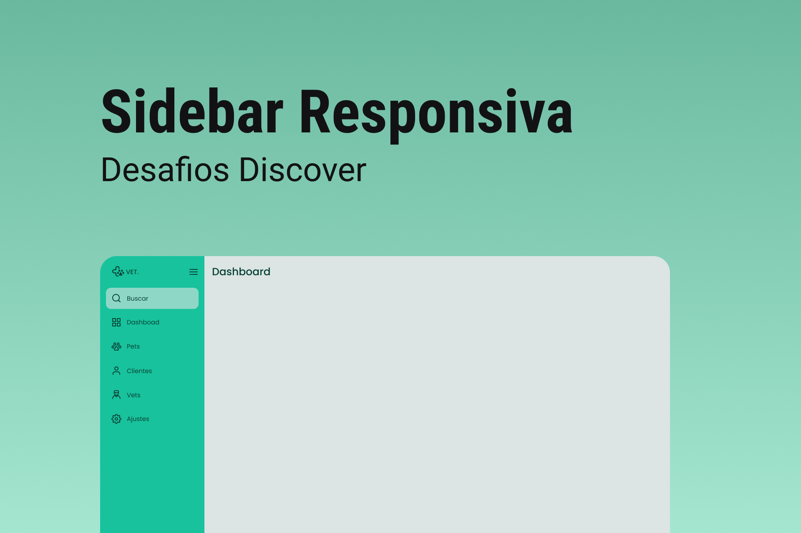

<h1 align="center"> Desafio Sidebar :computer: </h1>

  

## Sobre o projeto

Esse projeto foi tirado de um dos desafios do Discover, disponibilizado de forma gratuita na plataforma [Rocketseat](https://app.rocketseat.com.br/discover).

Um projeto que tem como objetivo de criar uma sidebar responsiva. Quando o usuário clicar no ícone do menu isso deve fazer com que o estado da sidebar mude entre "aberto", mostrando ícones e texto e "fechado", mostrando apenas os ícones.

Para mais detalhes sobre o projeto você pode conferir clicando [AQUI](https://app.rocketseat.com.br/discover/challenges/sidebar).

---

## 🚀 Tecnologias

Esse projeto foi desenvolvido com as seguintes tecnologias:

- HTML
- CSS
- JavaScript
- GIT
- GitHub

---
 
<h3 align="center">Feito com ♥ by Yasmin </h3>
